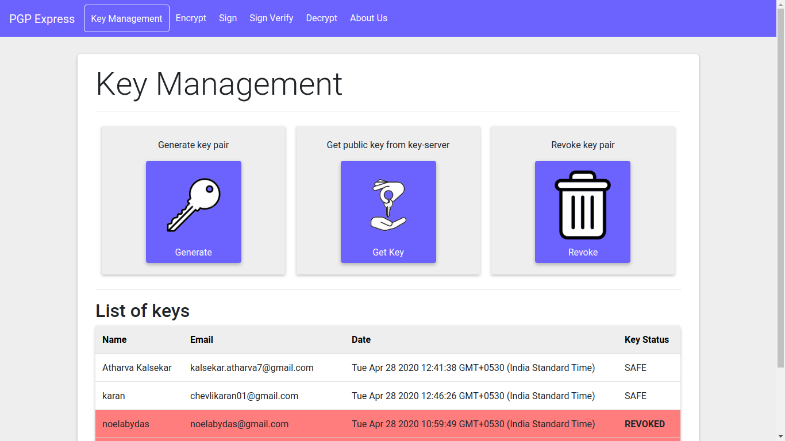

# Email PGP

**Email PGP** is an online **PGP (Pretty Good Privacy)** service that offers all the major functionalities of a typical PGP program, like encrypting and authenticating emails. It allows the user to :
* Generate key pairs
* Encrypt/decrypt messages
* Revoke keys
* Download keys
* Sign and verify messages

It uses [**openpgp.js**](https://openpgpjs.org/) library to implement those functions. You can visit their github repo [here](https://github.com/openpgpjs/openpgpjs)

## Getting Started

These instructions will get you a copy of the project up and running on your local machine for development and testing purposes.

### Prerequisites

You need to install node in your system. Download it from [here](https://nodejs.org/en/download/).

### Installing

A step by step series of examples that tell you how to get  the web application running

Clone the repo and enter inside the directory

```shell
$ git clone https://github.com/imabhi786/Email_pgp.git 
$ cd Email_pgp
```

Install all npm modules

```shell
$ npm install
```

Run the node app

```shell
$ node index.js
```

The app should be up and running at [localhost:3000](http://localhost:3000/)

### How to use
Follow the following steps to use the app properly :
1. Signing-in
   - Sign-in to the application using your google account
   - Once successfully done, you will be redirected to the home page
   - The home page contains the entire roadmap of the application
2. Generating key-pair
   - Firstly, you have to create your key-pair to use main features of PGP Express
   - Click on manage keys button on the home page and then click on generate keys
   - Fill in the form correctly and hit generate 
   - The private key will be stored locally and public key will be sent to the server
3. Encrypting the message
   - Click on encrypt link on the navigation bar
   - Enter the recipients email id and type in the message
   - Finally, click on encrypt
4. Signing the message
   - Click on sign link on the navigation bar
   - Paste the encrypted message inside the textbox
   - Finally, click on generate to generate the signature
5. Verifying the signature
   - Click on sign verify link on the navigation bar
   - Paste the signature part of received message inside the textbox
   - Finally, click on verify to see if the message is from the authentic user
6. Decrypting the message
   - Click on decrypt link on the navigation bar
   - Enter the encrypted message in the textbox
   - Finally, click on decrypt to see the original message
7. Revoking public key
   - On the key management page click on revoke keys button
   - Enter your password and confirm the revoke operation
8. Getting/displaying public key
   - On the key management page click on get key button
   - Enter the email id pf the user whose public key you want to see
   - Hit display public key to fetch the key from the server

### Screen shots

Following are two screen shots of our application. For indepth explanation and more screen shots see our project report.

#### Home Page  


#### Key Management


### Report

- TODO : Email PGP report link

### Built With

* HTML
* Javascript with AJAX
* CSS/bootstrap
* NodeJs
* MongoDB

## Contributors

* **Abhijeet Mathur** - U16CO081 
* **Atharva Kalsekar** - U16CO063
* **Karan Chevli** - U16CO112
* **Jashwanth Reddy** - U16CO073
* **Noel Aby Das** - U16CO072
* **Vedansh Agarwal** - U16CO066

Get more info and chekout the contributions [here](https://github.com/imabhi786/Email_pgp/graphs/contributors).
